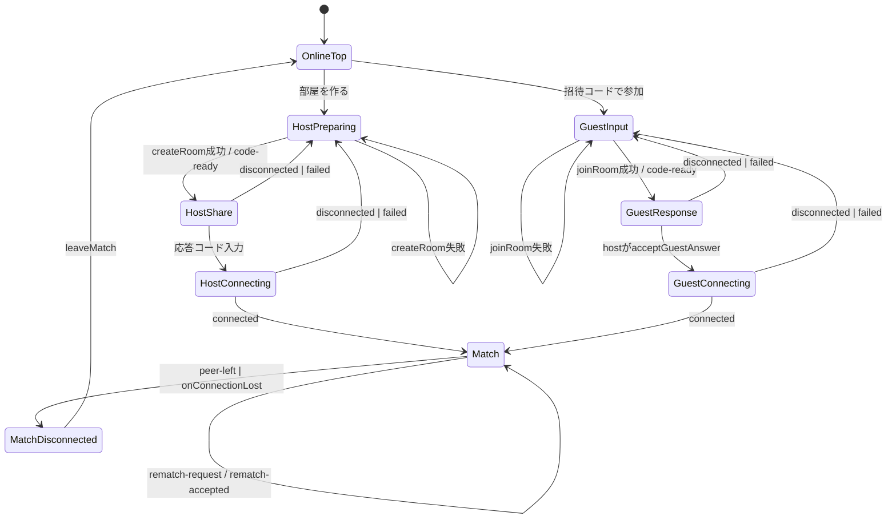

# Online参加フロー 状態遷移表

## 目的

- `online/create` `online/join` `online/match` の現在の導線を、画面状態と内部状態の両方で固定する。
- 各遷移にテスト ID を振り、表の未充足行をそのままテスト抜けとして検出できるようにする。
- `npm run test:coverage` の未到達枝と突き合わせて、オンライン対戦まわりの遷移漏れを防ぐ。

## 状態軸

| 軸         | 値                                                                   |
| ---------- | -------------------------------------------------------------------- |
| 画面       | `/online` `/online/create` `/online/join` `/online/match`            |
| ロール     | `null` `host` `guest`                                                |
| 接続状態   | `idle` `code-ready` `connecting` `connected` `disconnected` `failed` |
| 招待コード | 空 / あり                                                            |
| 対局状態   | `playing` `finished`                                                 |
| 再戦フラグ | `pendingRematch` `peerRequestedRematch`                              |

## 遷移図

## 画面遷移表

### 1. ホスト作成フロー

| ID     | 現状態                                  | トリガ                                                                   | 次状態                         | 期待 UI                                           | テスト                        |
| ------ | --------------------------------------- | ------------------------------------------------------------------------ | ------------------------------ | ------------------------------------------------- | ----------------------------- |
| OF-H01 | `/online`                               | 「部屋を作る」                                                           | `/online/create` + `preparing` | 準備中表示                                        | `App.logic`                   |
| OF-H02 | `preparing`                             | `createRoom` 成功                                                        | `share`                        | 招待コード・応答コード入力欄を表示                | `App.logic`                   |
| OF-H03 | `preparing`                             | `createRoom` 失敗                                                        | `preparing`                    | エラー表示、内部状態初期化                        | `useOnlineMatch`              |
| OF-H04 | `share`                                 | `acceptGuestAnswer` 成功で「answer待ち」が解消され、peer が `connecting` | `connecting`                   | 接続中表示                                        | `App.logic`, `useOnlineMatch` |
| OF-H05 | `share` or `connecting`                 | `disconnected` / `failed`                                                | `preparing`                    | 古い招待コードを隠し、部屋再作成へ戻す            | `App.logic`                   |
| OF-H06 | `preparing` + `disconnected` / `failed` | 「部屋を作り直す」                                                       | `preparing`                    | 実行中は単一リクエストのみ、retryボタンはdisabled | `App.logic`                   |
| OF-H07 | `connecting`                            | `connected`                                                              | `/online/match`                | 対局画面へ遷移                                    | `App.logic`                   |

### 2. ゲスト参加フロー

| ID     | 現状態                     | トリガ                                  | 次状態                   | 期待 UI                                    | テスト           |
| ------ | -------------------------- | --------------------------------------- | ------------------------ | ------------------------------------------ | ---------------- |
| OF-G01 | `/online`                  | 「招待コードで参加」                    | `/online/join` + `input` | 招待コード入力欄を表示                     | `App.logic`      |
| OF-G02 | `input`                    | `joinRoom` 成功                         | `response`               | 応答コード表示                             | `App.logic`      |
| OF-G03 | `input`                    | `joinRoom` 失敗                         | `input`                  | エラー表示、内部状態初期化                 | `useOnlineMatch` |
| OF-G04 | `response`                 | ホストが接続承認し peer が `connecting` | `connecting`             | 待機表示                                   | `App.logic`      |
| OF-G05 | `response` or `connecting` | `disconnected` / `failed`               | `input`                  | 応答コード表示を隠し、通常参加フローへ戻す | `App.logic`      |
| OF-G06 | `connected` + `guest`      | 接続完了副作用                          | join-request送信         | ホストへ参加要求送信                       | `useOnlineMatch` |
| OF-G07 | `connecting`               | `connected`                             | `/online/match`          | 対局画面へ遷移                             | `App.logic`      |

### 3. 対局中フロー

| ID     | 現状態                               | トリガ                           | 次状態                | 期待結果                                   | テスト                        |
| ------ | ------------------------------------ | -------------------------------- | --------------------- | ------------------------------------------ | ----------------------------- |
| OF-M01 | `host` + 自分手番                    | `submitMove(valid)`              | `sync-state`          | 盤面進行、revision+1                       | `useOnlineMatch`              |
| OF-M02 | `guest` + 自分手番                   | `submitMove(valid)`              | `move-request`送信    | ホストに着手依頼                           | `useOnlineMatch`              |
| OF-M03 | `host`                               | `move-request(stale)`            | 状態維持              | エラー表示 + 最新盤面再送                  | `useOnlineMatch`              |
| OF-M04 | `host`                               | `move-request(invalid)`          | 状態維持              | `error`送信                                | `useOnlineMatch`              |
| OF-M05 | `host` + パス可                      | `pass-request(valid)`            | `sync-state`          | 手番進行                                   | `useOnlineMatch`              |
| OF-M06 | `host`                               | `pass-request(invalid)`          | 状態維持              | `error`送信 + 最新盤面再送                 | `useOnlineMatch`              |
| OF-M07 | `guest` + パス可                     | `submitPass()`                   | `pass-request`送信    | ホストにパス依頼                           | `useOnlineMatch`              |
| OF-M08 | 接続不可 or 他人手番                 | `submitMove/submitPass`          | 状態維持              | 何もしない                                 | `useOnlineMatch`              |
| OF-M09 | `finished`                           | `requestRematch()`               | `pendingRematch=true` | 再戦申請送信                               | `useOnlineMatch`              |
| OF-M10 | `host` + `peerRequestedRematch=true` | `requestRematch()`               | 初期盤面へ            | `rematch-accepted` + `sync-state`          | `useOnlineMatch`              |
| OF-M11 | `guest` + `rematch-accepted`受信     | 状態維持                         | 再戦待ちフラグ解除    | `useOnlineMatch`                           |
| OF-M12 | 接続中                               | `peer-left` / `onConnectionLost` | エラー表示            | 切断通知表示、着手・パス・再戦操作を無効化 | `useOnlineMatch`              |
| OF-M13 | 接続中                               | `leaveMatch()`                   | `/`                   | `peer-left`送信後に初期化                  | `useOnlineMatch`, `App.logic` |

## テスト抜け防止の進め方

1. 状態を「画面」「ロール」「接続状態」「招待コード有無」「対局状態」に分解する。
2. その直積から、UI に見える状態だけをノードとして残す。
3. 各ノード間のイベントを 1 行 1 遷移で表に落とす。
4. 各行にテスト ID を付与し、テスト名にその挙動を直接対応させる。
5. `npm run test:coverage` を使って、表にあるのに未到達な分岐を洗い直す。

この方針だと、今後バグが増えても「新しい分岐を表に追加してからテストを書く」運用にできる。

## 補足

- 現在の接続方式はシグナリングサーバなしの WebRTC 手動 SDP 交換で、`host-offer` と `guest-answer` の両方が必要。
- 応答コードを完全になくすには、別のシグナリング経路を導入する必要がある。
- ホスト画面は raw な `connectionState` だけでなく、「まだ answer code を待っているか」を状態として持つ。これにより peer が先に `connecting` を報告しても入力欄を維持する。
- `peer-left` を受信した後は WebRTC の raw state が一時的に `connected` のままでも、オンライン対局の操作は peer 不在として扱い無効化する。
